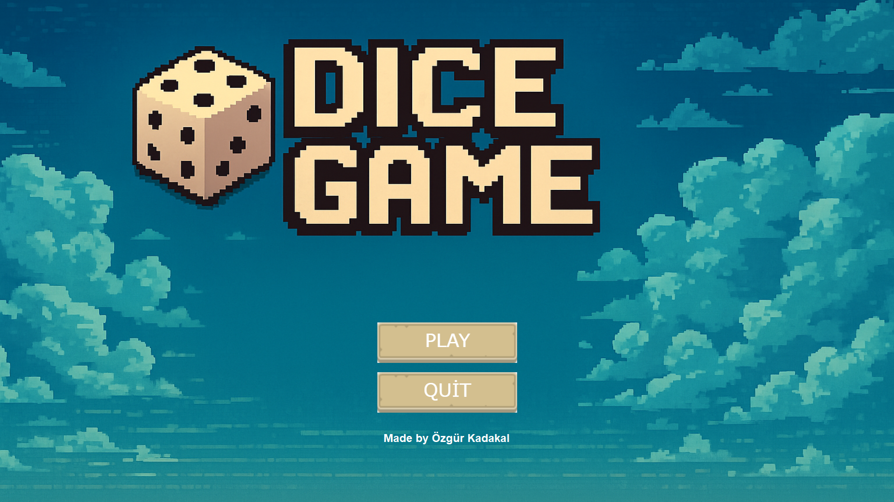
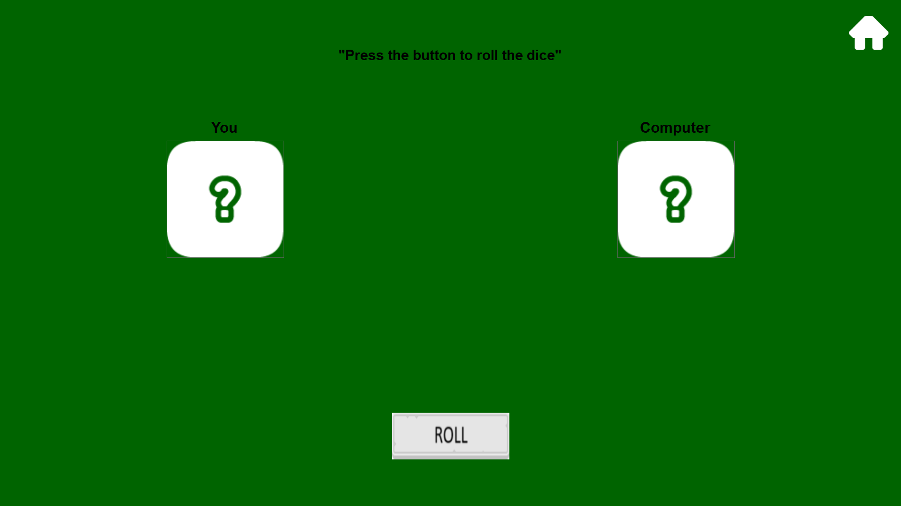
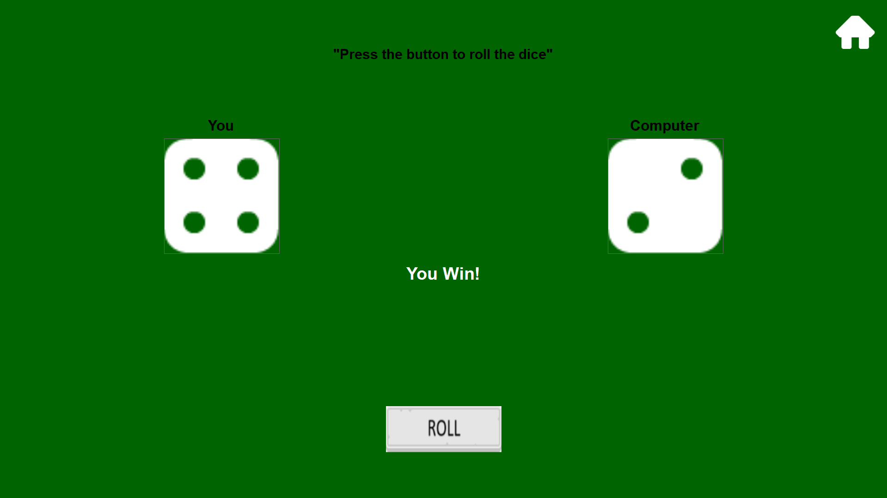

## 🌍 English

# 🎲 Dice Game

### - Developed by Özgür Kadakal

**⚠️ Important:** Please extract the downloaded `.zip` file before opening the project. Otherwise, it may not work properly.

---

## 🖼️ Gameplay Previews

### 🎮 In-Game Screenshot 1  

### 🎮 In-Game Screenshot 2  

### 🎮 In-Game Screenshot 3  

---

### 🎲 Dice Game  
A simple and fun dice rolling game developed using C# and Windows Forms by Özgür Kadakal.

### ✨ Features  
- 🎯 Custom mouse cursor tailored for the game  
- 🎵 Background music on the main menu  
- 🔊 Sound effects for dice rolling and button interactions  
- 🎨 Hover effects on buttons for better user experience  
- 🎲 Animated dice roll with smooth animation  
- 🖱️ Unique themed cursor that changes dynamically within the game  
- 🔄 Easy-to-use main menu navigation

🧑‍💻 *This project was developed from scratch by Özgür Kadakal.*  
📌 *All code and assets are original.*

---

## 📬 Contact  
For any feedback, questions, or suggestions, feel free to contact me:  
📧 ozgurkreach@gmail.com

---

## 🇹🇷 Türkçe

# 🎲 Zar Oyunu 🎮

### - Geliştirici: Özgür Kadakal

**⚠️ Önemli:** İndirdiğiniz `.zip` dosyasını ayıklayıp projeyi bu şekilde açınız. Aksi takdirde proje düzgün şekilde çalışmayabilir.

---

## 🖼️ Oynanış Önizlemeleri

### 🎮 Oyun İçi Görüntü 1  

### 🎮 Oyun İçi Görüntü 2  

### 🎮 Oyun İçi Görüntü 3  

---

### 🎲 Zar Oyunu  
C# ve Windows Forms kullanılarak Özgür Kadakal tarafından geliştirilmiş basit ve eğlenceli bir zar atma oyunudur.

### ✨ Özellikler  
- 🎯 Oyuna özel fare imleci  
- 🎵 Ana menüde arka plan müziği  
- 🔊 Zar atma ve buton etkileşim ses efektleri  
- 🎨 Butonlarda hover efektleri ile görsel zenginlik  
- 🎲 Zar atma animasyonu  
- 🖱️ Oyun içinde dinamik olarak değişen temalı imleç tasarımı  
- 🔄 Kullanımı kolay ana menü navigasyonu

🧑‍💻 *Bu proje Özgür Kadakal tarafından sıfırdan geliştirilmiştir.*  
📌 *Tüm kodlar ve içerikler özgündür.*

---

## 📬 İletişim  
Her türlü geri bildirim, soru veya öneri için:  
📧 ozgurkreach@gmail.com
